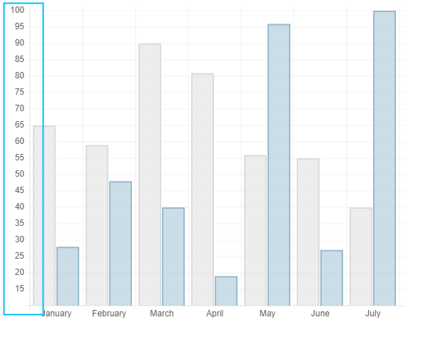

# Chart 学习

## 计算 label 的最大宽度

[MND](https://developer.mozilla.org/zh-CN/docs/Web/API/CanvasRenderingContext2D/measureText)

测量文本 TextMetrics 对象包含的信息,宽度信息

```js
const canvas = document.getElementById('canvas');
const ctx = canvas.getContext('2d');
const text = ctx.measureText('foo'); // TextMetrics object
text.width; // 16;
```


获取 label 最大宽度

```js
var barChartData = {
  labels: ['January', 'February', 'March', 'April', 'May', 'June', 'July'],
  datasets: [
    {
      fillColor: 'rgba(220,220,220,0.5)',
      strokeColor: 'rgba(220,220,220,1)',
      data: [65, 59, 90, 81, 56, 55, 40],
    },
    {
      fillColor: 'rgba(151,187,205,0.5)',
      strokeColor: 'rgba(151,187,205,1)',
      data: [28, 48, 40, 19, 96, 27, 100],
    },
  ],
};
```

计算最大宽度

```js
// 最大宽度
widestXLabel = 1;

/**
 * 获取文本最大宽度
 * 依次遍历labels所有文本，计算最大的宽度
 */
for (var i = 0; i < data.labels.length; i++) {
  var textLength = ctx.measureText(data.labels[i]).width;
  widestXLabel = textLength > widestXLabel ? textLength : widestXLabel;
}
```

## 计算画布最大高度

当一行不足以放下 label 时需要将 label 倾斜，倾斜后图标高度要重新计算


数据集

```js
var barChartData = {
  labels: [
    'January========',
    'February',
    'March',
    'April',
    'May',
    'June',
    'July',
  ],
  datasets: [
    {
      fillColor: 'rgba(220,220,220,0.5)',
      strokeColor: 'rgba(220,220,220,1)',
      data: [65, 59, 90, 81, 56, 55, 40],
    },
    {
      fillColor: 'rgba(151,187,205,0.5)',
      strokeColor: 'rgba(151,187,205,1)',
      data: [28, 48, 40, 19, 96, 27, 100],
    },
  ],
};
```

实现代码

```js
/**
 * rotateLabels 旋转角度
 */

// 如果所有文字总宽度大于最大宽度就倾斜 45度
if (width / data.labels.length < widestXLabel) {
  // 倾斜45度
  rotateLabels = 45;
  // 如果所有文字倾斜后的总宽度大于最大宽度就倾斜 90度
  if (width / data.labels.length < Math.cos(rotateLabels) * widestXLabel) {
    rotateLabels = 90;
    // 图表高度 = 等于总画布高度 - 文字高度
    maxSize -= widestXLabel;
  } else {
    // 图表高度 = 等于总画布高度 - 文字高度
    maxSize -= Math.sin(rotateLabels) * widestXLabel;
  }
} else {
  // 图表高度 = 等于总画布高度 - 文字高度
  maxSize -= config.scaleFontSize;
}
// 文字和图标之间添加一些边距
maxSize -= 5;
// label高度=字体大小
labelHeight = config.scaleFontSize;
// 减去label高度
maxSize -= labelHeight;
// 高度
scaleHeight = maxSize;
```

## 计算最大最小值



数据集

```js
var barChartData = {
  labels: ['January', 'February', 'March', 'April', 'May', 'June', 'July'],
  datasets: [
    {
      fillColor: 'rgba(220,220,220,0.5)',
      strokeColor: 'rgba(220,220,220,1)',
      data: [65, 59, 90, 81, 56, 55, 40],
    },
    {
      fillColor: 'rgba(151,187,205,0.5)',
      strokeColor: 'rgba(151,187,205,1)',
      data: [28, 48, 40, 19, 96, 27, 100],
    },
  ],
};
```

实现

```js
// 最大值
var upperValue = Number.MIN_VALUE;
// 最小值
var lowerValue = Number.MAX_VALUE;
for (var i = 0; i < data.datasets.length; i++) {
  for (var j = 0; j < data.datasets[i].data.length; j++) {
    if (data.datasets[i].data[j] > upperValue) {
      upperValue = data.datasets[i].data[j];
    }
    if (data.datasets[i].data[j] < lowerValue) {
      lowerValue = data.datasets[i].data[j];
    }
  }
}

console.log('upperValue', upperValue); // 100
console.log('lowerValue', lowerValue); // 19
// 分段数量，图中总共分段18段
// 最多分段
const maxSteps = Math.floor(scaleHeight / (labelHeight * 0.66)); // 53
// 最小分段
const minSteps = Math.floor((scaleHeight / labelHeight) * 0.5); // 17
```

## 刻度计算scale


### 保留小数位数

`Number.prototype.toFixed()`使用定点表示法来格式化一个数值。[MDN](https://developer.mozilla.org/zh-CN/docs/Web/JavaScript/Reference/Global_Objects/Number/toFixed)

```js
function financial(x) {
  return Number.parseFloat(x).toFixed(2);
}

console.log(financial(123.456));
// expected output: "123.46"

console.log(financial(0.004));
// expected output: "0.00"

console.log(financial('1.23e+5'));
// expected output: "123000.00"
```

获取小数位数

```js
function getDecimalPlaces(num) {
  if (num % 1 != 0) {
    return num.toString().split('.')[1].length;
  } else {
    return 0;
  }
}

console.log('fixed', getDecimalPlaces(1.11)); // 2
console.log('fixed', getDecimalPlaces(1)); // 0
```

### 计算数量级

```js
function calculateOrderOfMagnitude(val) {
  return Math.floor(Math.log(val) / Math.LN10);
}

console.log(calculateOrderOfMagnitude(1)); // 0
console.log(calculateOrderOfMagnitude(10)); // 1
console.log(calculateOrderOfMagnitude(100)); // 1
console.log(calculateOrderOfMagnitude(1000)); // 2
console.log(calculateOrderOfMagnitude(10000)); // 4
```

### 计算刻度相关参数

计算刻度**最小值**，**刻度值**，**总刻度数量**，**刻度文本列表**


```js
// 计算值的范围 maxValue 100,minValue 19
const valueRange = maxValue - minValue; // 81

const graphMin =
  Math.floor(minValue / (1 * Math.pow(10, rangeOrderOfMagnitude))) *
  Math.pow(10, rangeOrderOfMagnitude); // 最小刻度 10

const graphMax =
  Math.ceil(maxValue / (1 * Math.pow(10, rangeOrderOfMagnitude))) *
  Math.pow(10, rangeOrderOfMagnitude); // 最大刻度 100

const graphRange = graphMax - graphMin; // 差值，范围  100 - 10 = 90

// 每一步的进度值
const stepValue = Math.pow(10, rangeOrderOfMagnitude); // 10

// 总刻度数量
const numberOfSteps = Math.round(graphRange / stepValue); // 9

/**
 * minSteps 17,maxSteps 53
 */
while (numberOfSteps < minSteps || numberOfSteps > maxSteps) {
  if (numberOfSteps < minSteps) {
    stepValue /= 2;
    numberOfSteps = Math.round(graphRange / stepValue);
  } else {
    stepValue *= 2;
    numberOfSteps = Math.round(graphRange / stepValue);
  }
}
console.log('stepValue', stepValue); // 5
console.log('numberOfSteps', numberOfSteps); // 18

var labels = [];
for (var i = 1; i < numberOfSteps + 1; i++) {
  labels.push((graphMin + stepValue * i).toFixed(getDecimalPlaces(stepValue)));
}

// ['15', '20', '25', '30', '35', '40', '45', '50', '55', '60', '65', '70', '75', '80', '85', '90', '95', '100']
console.log('labels', labels);
```
